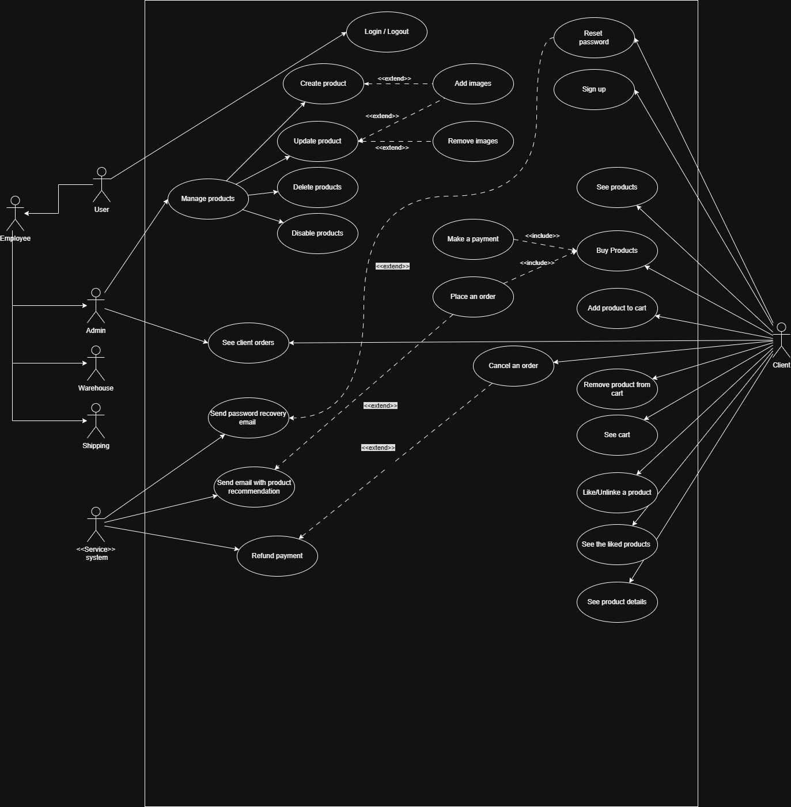

# E-Commerce REST API

A general porpuse e-commerce REST API built with Spring Boot 4.0.1 and Java 21, designed for managing products, orders, shopping carts, and user operations.

## Table of Contents

- [Overview](#overview)
- [Features](#features)
- [Technology Stack](#technology-stack)
- [Diagrams](#diagrams)
- [API Documentation](#api-documentation)
- [Getting Started](#getting-started)

## Overview

This is a production-ready RESTful API for an e-commerce platform that provides comprehensive functionality for product management, order processing, shopping cart operations, user authentication, and inventory tracking. The API is built following REST best practices and includes HATEOAS support for enhanced discoverability.

## Features

- **Product Management**
  - CRUD operations for products
  - Product categorization and tagging
  - Product image management
  - Product stock tracking
  - Product likes by client
  - Product search and filtering
  - Enable/disable products

- **Order Management**
  - Order creation and tracking
  - Order details and billing
  - Delivery tracking
  - Order history logs

- **Shopping Cart**
  - Cart management for registered and unregistered clients
  - Add/update/remove items
  - Persistent cart storage on database

- **User Management**
  - Client and employee user types
  - User authentication and authorization
  - Password recovery tokens
  - User roles and permissions
  - Refresh token support

- **Inventory & Warehouse**
  - Multi-warehouse support
  - Stock kardex/ledger tracking
  - Product changes logging

- **Payment Integration**
  - Stripe payment integration
  - Payment method management
  - Payment event logging

- **Email Notifications**
  - Email logging system
  - Transaction emails

## Technology Stack

- **Framework:** Spring Boot 4.0.1
- **Database:** PostgreSQL
- **ORM:** Hibernate / Spring Data JPA
- **API Architecture:** RESTful with HATEOAS
- **Payment Gateway:** Stripe
- **Database Migration:** Hibernate DDL Auto

## Diagrams

**Entity Relationship Diagram (ERD)**


**Use Case Diagram**



## API Documentation

The API follows OpenAPI 3.1 specification. Complete documentation is available in [open-api.spec.yml](documentation/open-api.spec.yml).

We can use the visualization tool [Swagger Visual tool](https://explore.swaggerhub.com/catalog?owner=ravn-606&api=Ecommerce&version=1.0.0) to view and interact with the endpoints.

### Base URL
```
http://localhost:8080/api/v1
```

## Getting Started

### Installation

1. **Clone the repository**
   ```bash
   git clone https://github.com/ilopez-ravn/rest-api-ecommerce.git
   cd rest-api-ecommerce/ecommerce
   ```

2. **Configure database connection**
   
   Edit `src/main/resources/application.properties` with your database credentials:
   ```properties
   spring.datasource.url=jdbc:postgresql://localhost:5432/ecommerce
   spring.datasource.username=your_username
   spring.datasource.password=your_password
   ```

3. **Open on IntelliJ IDEA**
   ```bash
   run the project on IntelliJ IDEA and use the endpoints
   ```


Useful links:
- [HashiCorp Vault](https://medium.com/@afdulrohmat03/how-to-secure-secret-data-in-spring-boot-using-hashicorp-vault-e1b37c269a15)

